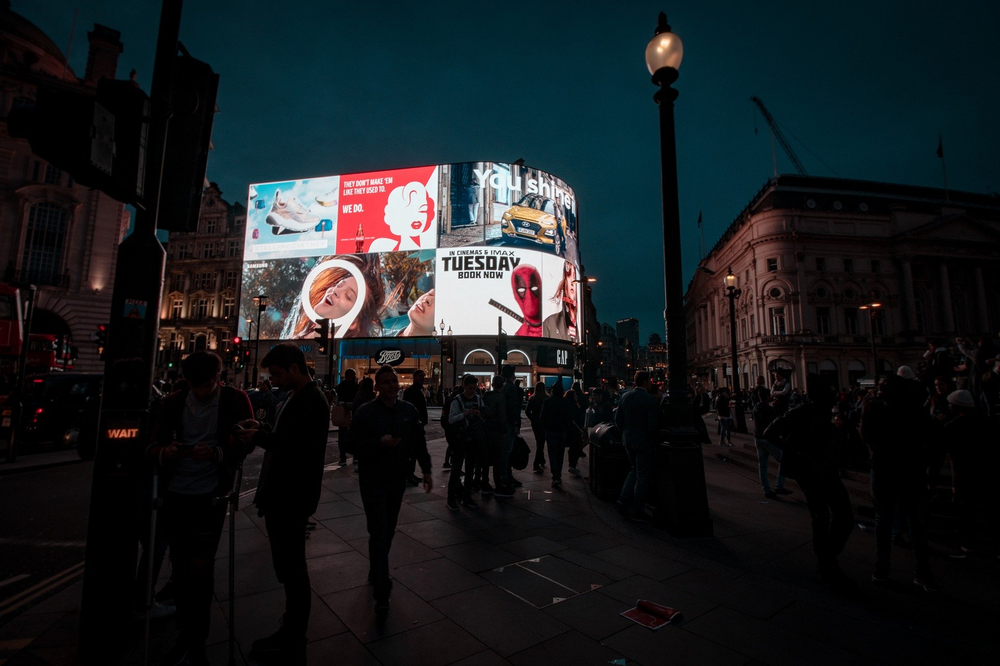
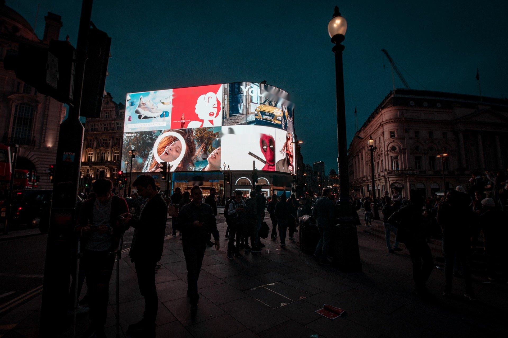

# Detect and remove text from image using Keras-ocr


## Setup
```
pip install -r requirements.txt
```
-----------------------------------------
## detect_text.py
Extract text from image.

Input: 
Output: 
```
['top', '15', 'freelance', 'billboard', 'lulu', 'new', 'designers', 'summer', 'collection', '2022', 'for', 'hire', 'in', 'designhill']
```

-------------------------------------------
## rem_text.py
Remove text from image using cv2's inpaint function.

| Input | Output |
| ------|--------|
|  | 